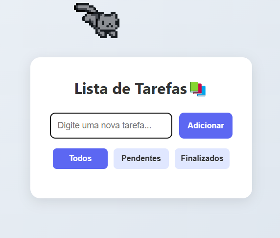

### 📋 To-Do List — Projeto Simples

Uma aplicação de lista de tarefas com visual moderno, onde você pode adicionar, remover, marcar como concluída e filtrar suas tarefas.

   

---

### ✨ Funcionalidades

* ✅ Adicionar tarefas
* 📝 Marcar tarefas como concluídas
* 🗑️ Remover tarefas
* 🔍 Filtros de visualização: **Todas**, **Pendentes** e **Finalizadas**

---

### 🚀 Como usar

1. Clone este repositório:

   ```bash
   git clone https://github.com/seu-usuario/nome-do-repo.git
   ```

2. Abra o `index.html` em seu navegador.

> Não precisa de instalação de dependências ou servidor — é só HTML, CSS e JavaScript puro.

---

### 🎨 Tecnologias usadas

* HTML5
* CSS3
* JavaScript puro (Vanilla JS)

---

### 📁 Estrutura dos arquivos

```
📦 to-do-list
 ┣ 📄 index.html
 ┣ 📄 style.css
 ┗ 📄 script.js
```

---

### 💡 Personalização

Você pode facilmente:

* Alterar as cores no `style.css`
* Adicionar salvamento em localStorage
* Conectar a um backend no futuro


